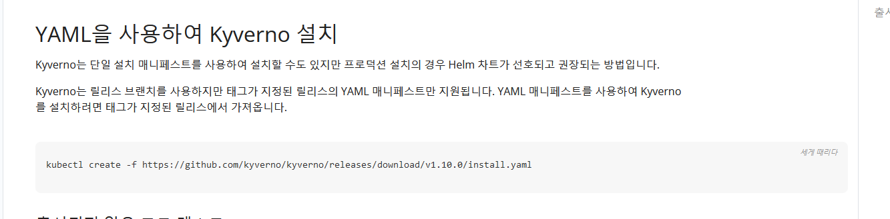
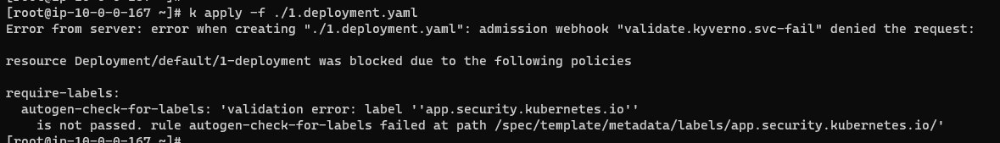
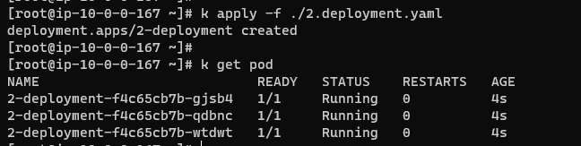

References
- https://kyverno.io/docs/installation/methods/

## install Kyverno 

```
kubectl create -f https://github.com/kyverno/kyverno/releases/download/v1.10.0/install.yaml
```

## apply policy
```
해당 폴리시는 파드가 app.security.kubernetes.io: pass라는 라벨이 있어야 한다.
```

## TEST
```
1.deployment.yaml은 라벨이 없는 상태이고, 2.deployment.yaml은 라벨이 있는 상태이다.
```


```
k apply -f ./1.deployment.yaml
```


```
k apply -f ./2.deployment.yaml
```
