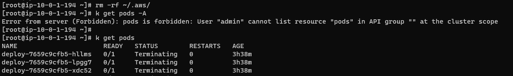
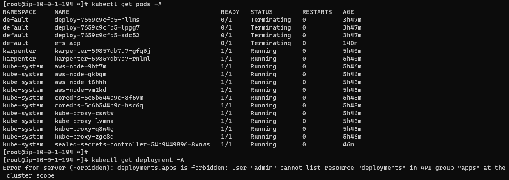

## aws-auth setting
```
k edit -n kube-system cm/aws-auth
```

#### Grant all privileges to the iam role (default)
```
apiVersion: v1
data:
  mapRoles: |
    - groups:
      - system:master
      rolearn: arn:aws:iam::532003114460:role/AdministratorAccess
      username: admin
```

#### Permission Control Settings
```
k apply role.yaml && k apply -f ./rolebinding.yaml
```

## Test


---
#### Create per cluster
```
k apply -f ./cluster-role.yaml && k apply -f ./clusterrolebinding.yaml
```
