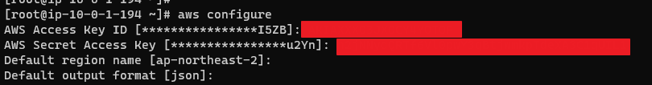
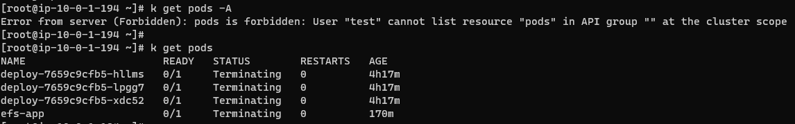
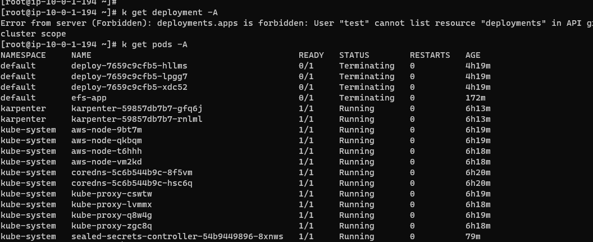

## aws-auth setting
```
k edit -n kube-system cm/aws-auth
```

#### Grant all privileges to the iam role (default)
```
apiVersion: v1
data:
  mapUsers: |
    - groups:
      - rbac.authorization.k8s.io/v1
      userarn: arn:aws:iam::532003114460:user/test
      username: test
```

#### setting
```
aws configure
```


#### Permission Control Settings
```
k apply role.yaml && k apply -f ./rolebinding.yaml
```

## Test

---

#### setting
```
aws configure
```


#### Create per cluster
```
k apply -f ./cluster-role.yaml && k apply -f ./clusterrolebinding.yaml
```

## Test
