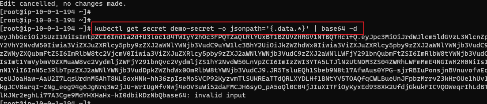
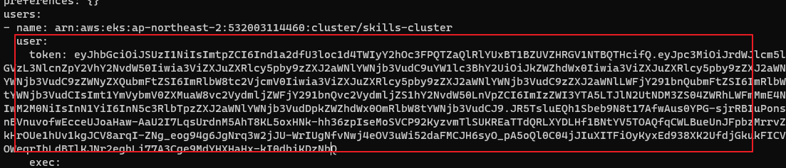
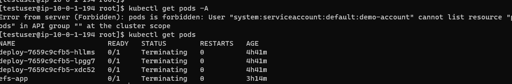
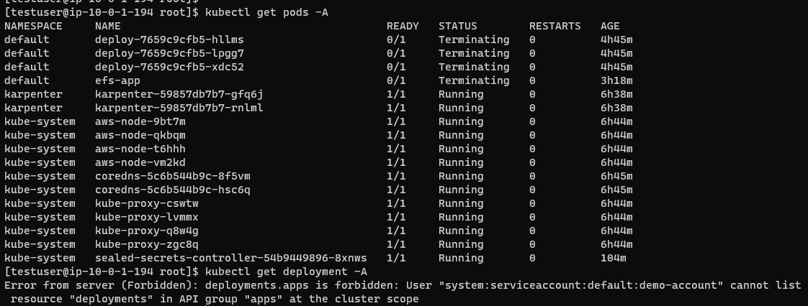

#### create user
```
adduser -m testuser
su testuser
cd ~
```


#### connect eks cluster
```
aws eks update-kubeconfig --name skills-cluster --region ap-northeast-2
exit
```

#### sa & sa token create
```
k apply -f sa.yaml && k apply -f ./secret.yaml
kubectl get secret demo-secret -o jsonpath='{.data.*}' | base64 -d
```
// copy token



```
k apply -f role.yaml && k apply -f rolebinding.yaml
```

Apply Linux Users
```
su testuser
vim ~/.kube/config
```


## TEST


---

cluster role apply
```
k apply -f ./clusterrole.yaml && k apply -f ./clusterrolebinding.yaml
```
Apply Linux Users
```
su testuser
vim ~/.kube/config
```

## TEST
