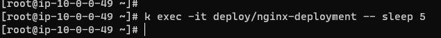
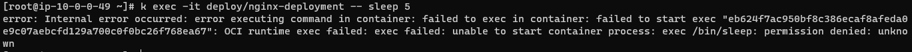

## app armor sleep deny

install karmor
```bash
curl -sfL http://get.kubearmor.io/ | sudo sh -s -- -b /usr/local/bin
karmor install
```

###  deployment
```bash
k apply -f deploymant.yaml
```

### Test
```
k exec -it deploy/nginx-deployment -- sleep 5
```


### apply kubearmorpolicy
```bash
k apply -f ./armor-policy.yaml
```

### Test
```
k exec -it deploy/nginx-deployment -- sleep 5
```
