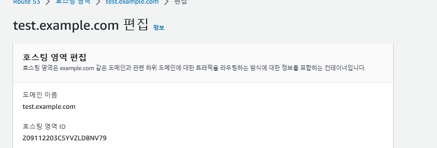
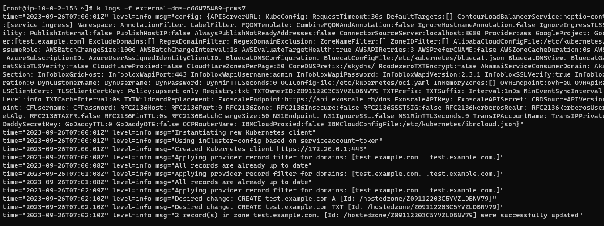
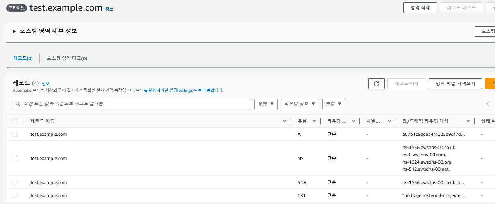

References
- https://github.com/kubernetes-sigs/external-dns/releases
- https://kim-dragon.tistory.com/146

### create namespace
```
kubectl create namespace external-dns
```

### IAM policy
```
cat > AllowExternalDNSUpdates.json << EOF
{
  "Version": "2012-10-17",
  "Statement": [
    {
      "Effect": "Allow",
      "Action": [
        "route53:ChangeResourceRecordSets"
      ],
      "Resource": [
        "arn:aws:route53:::hostedzone/*"
      ]
    },
    {
      "Effect": "Allow",
      "Action": [
        "route53:ListHostedZones",
        "route53:ListResourceRecordSets"
      ],
      "Resource": [
        "*"
      ]
    }
  ]
}
EOF

aws iam create-policy --policy-name AllowExternalDNSUpdates --policy-document file://AllowExternalDNSUpdates.json
```

### IAM Role
```
eksctl create iamserviceaccount \
    --name external-dns \
    --namespace default \
    --cluster skills-cluster \
    --attach-policy-arn arn:aws:iam::532003114460:policy/AllowExternalDNSUpdates \
    --approve \
    --override-existing-serviceaccounts
```

### create route53 
Record the domain name and the hosting area ID portion.




### create external dns
Based on the information, modify args and proceed with the distribution.
```
k apply -f ./externaldns.yaml
```

### deployment & service
```
k apply -f ./deployment.yaml
```



