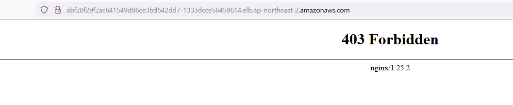

## istio
References
- https://www.daddyprogrammer.org/post/13721/istio-service-mesh/
- https://istio.io/latest/docs/setup/getting-started/


### istio install
```bash
curl -L https://git.io/getLatestIstio | sh -
cd istio-1.19.0
sudo mv -v bin/istioctl /bin/
```


```bash
istioctl install
```

### application namespace
```bash
k apply -f ./ns.yaml
```

### nginx deploy
```bash
k apply -f ./nginx-deployment.yaml
```
-> two nginx applications and one service

### httpd deploy
```bash
k apply -f ./httpd-deployment.yaml
```
-> two httpd applications and one service


### virtual service && gateway
```bash
k apply -f ./virtual-gw-svc.yaml
```

### nlb && edit
```bash
istioctl upgrade -f ./nlb.yaml
```

```bash
kubectl edit -n istio-system svc/istio-ingressgateway
```
### remove


## TEST

#### Four pages are randomly printed.





---

## version management
- / -> nginx v1: httpd v1 = 50:50
- /v2 -> httpd v2 = 100
- /version2 -> nginx v2 = 100

```bash
k apply -f ./virtual-destination.yaml
k apply -f ./virtualservice.yaml
```