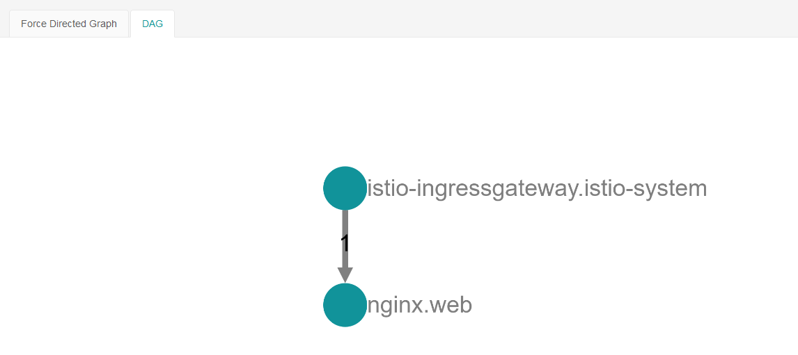
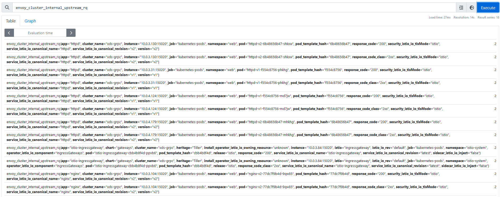
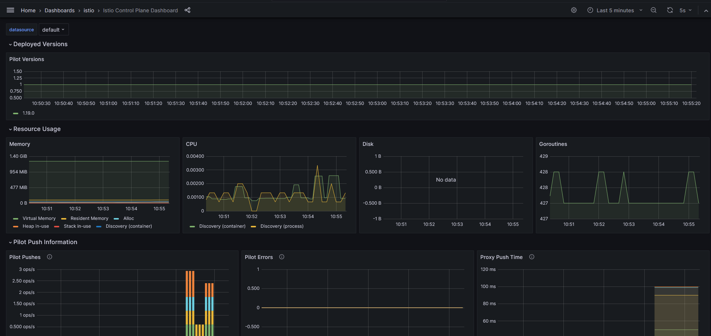
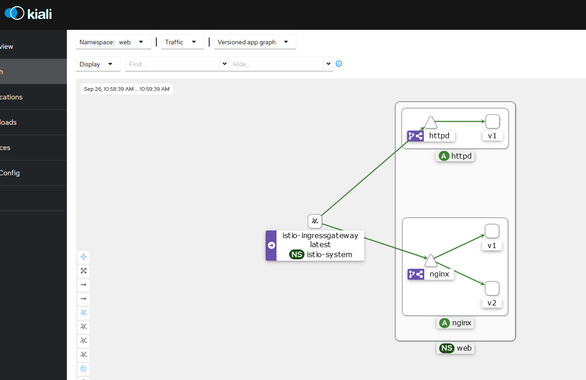

## jaeger
References
- https://istio.io/latest/docs/ops/integrations/jaeger/
- https://lcc3108.github.io/articles/2021-12/istio-temetry-drtribute-tracing
- https://istio.io/latest/docs/tasks/observability/distributed-tracing/jaeger/

```bash
kubectl apply -f https://raw.githubusercontent.com/istio/istio/release-1.19/samples/addons/jaeger.yaml
```

test
```bash
istioctl dashboard jaeger --address=0.0.0.0
```




## Prometheus
References
- https://istio.io/latest/docs/ops/integrations/prometheus/

```bash
kubectl apply -f https://raw.githubusercontent.com/istio/istio/release-1.19/samples/addons/prometheus.yaml
```

test
```bash
istioctl dashboard prometheus --address=0.0.0.0
```


## grafana
References
- https://istio.io/latest/docs/ops/integrations/grafana/

```bash
kubectl apply -f https://raw.githubusercontent.com/istio/istio/release-1.19/samples/addons/grafana.yaml
```
test
```bash
istioctl dashboard grafana --address=0.0.0.0
```


## kiali
References
- https://istio.io/latest/docs/ops/integrations/kiali/

```bash
kubectl apply -f https://raw.githubusercontent.com/istio/istio/release-1.19/samples/addons/kiali.yaml
```
test
```bash
istioctl dashboard kiali --address=0.0.0.0
```

