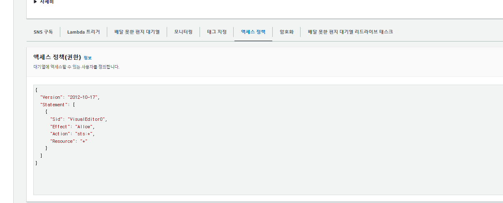
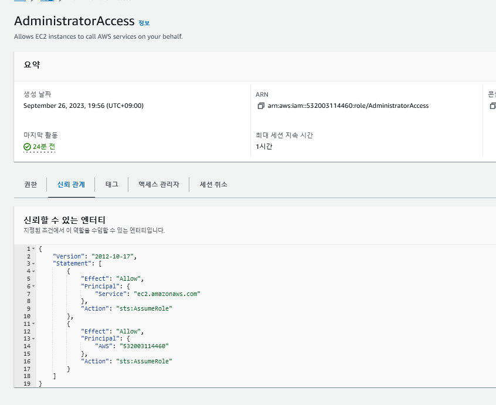
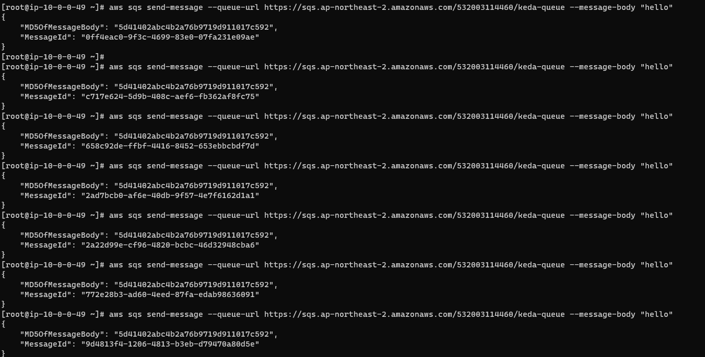
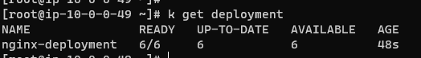
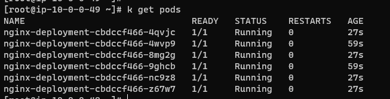

# Keda
References
- https://keda.sh/docs/2.10/concepts/scaling-deployments/


### install keda
```
helm repo add kedacore https://kedacore.github.io/charts
helm repo update
kubectl create namespace keda
helm install keda kedacore/keda --namespace keda
```

### deploy application
```
k apply -f deployment.yaml
```

### create keda-queue
```
aws sqs create-queue --queue-name keda-queue
```


encoding base64
```
[root@ip-10-0-0-49 ~]# echo arn:aws:iam::532003114460:role/AdministratorAccess | base64
YXJuOmF3czppYW06OjUzMjAwMzExNDQ2MDpyb2xlL0FkbWluaXN0cmF0b3JBY2Nlc3MK
```

### create secret
```yaml
apiVersion: v1
kind: Secret
metadata:
  name: admin-secrets
data:
  AWS_ROLE_ARN: YXJuOmF3czppYW06OjUzMjAwMzExNDQ2MDpyb2xlL0FkbWluaXN0cmF0b3JBY2Nlc3M=
```

### apply keda
```bash
k apply -f ./secret.yaml && k apply -f ./triggerauthentication.yaml && k apply -f ./scaledobject.yaml
```



## TEST

### send message




