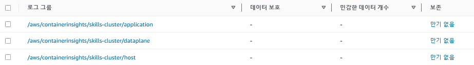

## Kubernetes Fluentd EKS log to cloudwatch

create cloudwatch namespace
```
k apply -f https://raw.githubusercontent.com/aws-samples/amazon-cloudwatch-container-insights/master/k8s-yaml-templates/cloudwatch-namespace.yaml
```

create iam service account
```
eksctl create iamserviceaccount --name fluentd --namespace amazon-cloudwatch --cluster <cluster-name> --attach-policy-arn arn:aws:iam::aws:policy/CloudWatchAgentServerPolicy --approve --override-existing-serviceaccounts
```

create configmap
```
kubectl create configmap cluster-info --from-literal=cluster.name=<cluster name> --from-literal=logs.region=<region-code> -n amazon-cloudwatch
```

deploy fluentd
```
k apply -f https://raw.githubusercontent.com/aws-samples/amazon-cloudwatch-container-insights/latest/k8s-deployment-manifest-templates/deployment-mode/daemonset/container-insights-monitoring/fluentd/fluentd.yaml
```

result
