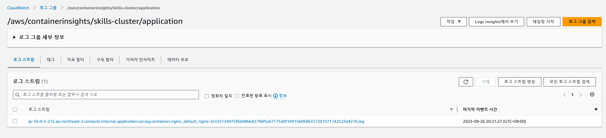
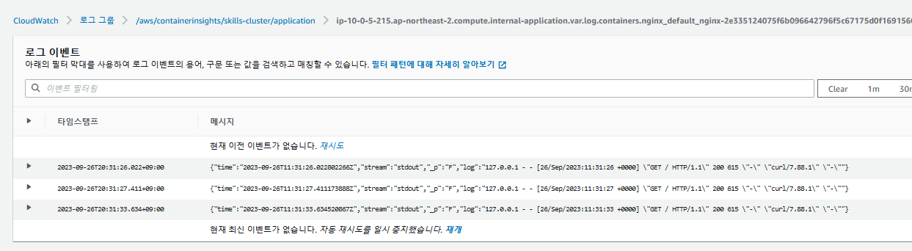

# fluent-bit

References
- https://docs.aws.amazon.com/ko_kr/AmazonCloudWatch/latest/monitoring/Container-Insights-setup-logs-FluentBit.html
### deploy namespace
```
k apply -f https://raw.githubusercontent.com/aws-samples/amazon-cloudwatch-container-insights/latest/k8s-deployment-manifest-templates/deployment-mode/daemonset/container-insights-monitoring/cloudwatch-namespace.yaml
```

### create iam service account
```
eksctl create iamserviceaccount --name fluent-bit --namespace amazon-cloudwatch --cluster skills-cluster --attach-policy-arn arn:aws:iam::aws:policy/CloudWatchAgentServerPolicy --approve --override-existing-serviceaccounts
```

### create configmap
```
ClusterName=skills-cluster
RegionName=ap-northeast-2
FluentBitHttpPort='2020'
FluentBitReadFromHead='Off'
[[ ${FluentBitReadFromHead} = 'On' ]] && FluentBitReadFromTail='Off'|| FluentBitReadFromTail='On'
[[ -z ${FluentBitHttpPort} ]] && FluentBitHttpServer='Off' || FluentBitHttpServer='On'
kubectl create configmap fluent-bit-cluster-info \
--from-literal=cluster.name=${ClusterName} \
--from-literal=http.server=${FluentBitHttpServer} \
--from-literal=http.port=${FluentBitHttpPort} \
--from-literal=read.head=${FluentBitReadFromHead} \
--from-literal=read.tail=${FluentBitReadFromTail} \
--from-literal=logs.region=${RegionName} -n amazon-cloudwatch
```

### apply app & fluent-bit
```
k apply -f ./pod.yaml && k apply -f ./fluent-bit.yaml
```

### curl test
```
k exec -it nginx -- curl localhost
```

## result

