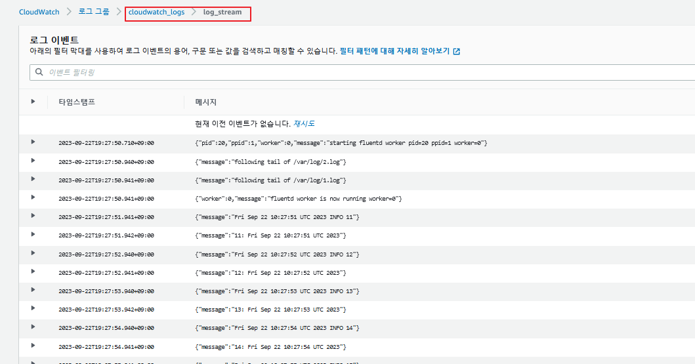

## Fluentd sidecer logging
create service account
```
eksctl create iamserviceaccount --cluster=skills-cluster --name=fluentd-role --attach-policy-arn=arn:aws:iam::aws:policy/CloudWatchFullAccess --approve
```

command
```
k apply -f ./pod.yaml
k apply -f ./configmap.yaml
```

