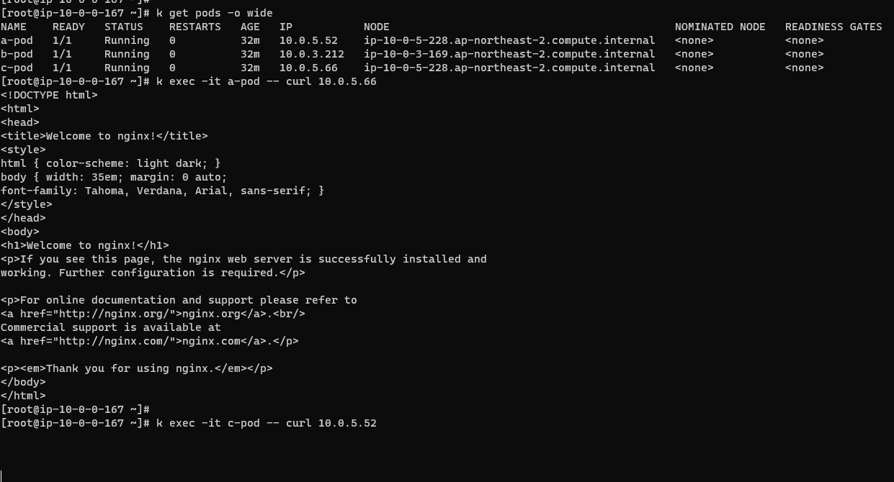
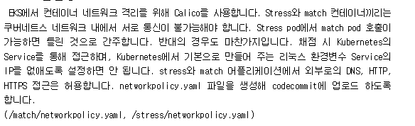

References
- https://docs.aws.amazon.com/ko_kr/eks/latest/userguide/calico.html

#### etc
- https://archive.eksworkshop.com/beginner/120_network-policies/calico/stars_policy_demo/create_resources/
- calico/networkpolicy/

## install calico
```
helm repo add projectcalico https://docs.tigera.io/calico/charts
kubectl create namespace tigera-operator
helm install calico projectcalico/tigera-operator --version v3.25.2 --namespace tigera-operator
helm install calico projectcalico/tigera-operator --version v3.25.2 -f values.yaml --namespace tigera-operator
```

## calicoctl install
```
curl -L https://github.com/projectcalico/calico/releases/download/v3.25.2/calicoctl-linux-amd64 -o kubectl-calico
chmod +x kubectl-calico
mv kubectl-calico /bin/
```

### network policy apply
```bash
kubectl calico apply -f manifest.yaml 
```

문제
```
1. A 파드는 인터넷이랑 인바운드 아웃바운드 가능
2. A 파드는 B 파드와 인바운드 아웃바운드 가능
3. A 파드는 C 파드와 인바운드 아웃바운드 불가능
```

### create pods
```bash
kubectl apply -f ./a-pod.yaml && kubectl apply -f ./b-pod.yaml && kubectl apply -f ./c-pod.yaml
```

### apply networkpolicy
```
k apply -f ./networkpolicy.yaml
```

## TEST


c -> a 요청이 차단된 것을 확인할 수 있다.

---

#### 57회 전국기능경기대회 calico 답안
```
match-networkpolicy.yaml
stress-networkpolicy.yaml
```
