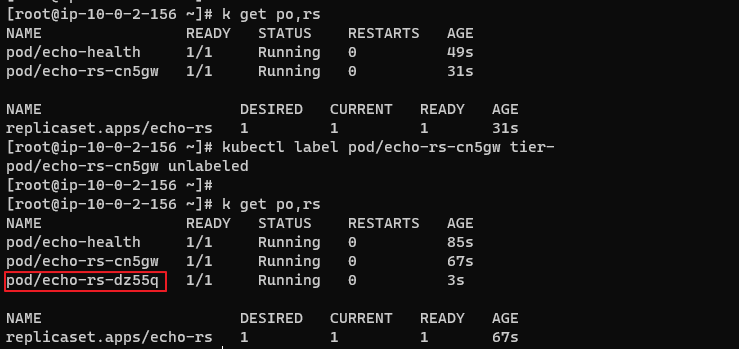
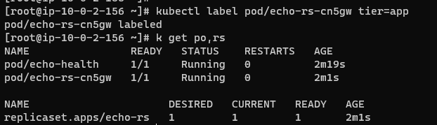
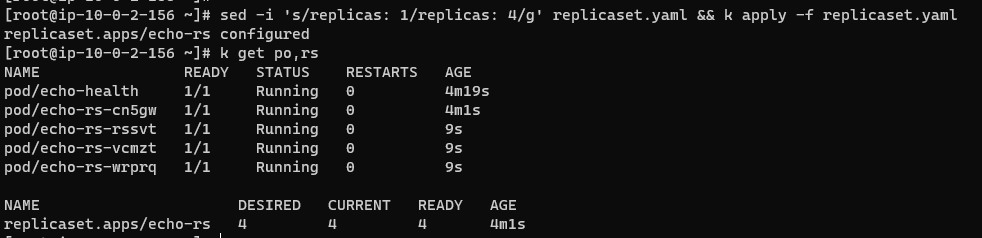

### pod 생성
```
k apply -f ./pod.yaml
```

### replicaset 생성
```
k apply -f ./replicaset.yaml
```


### 리소스 확인
```
k get po,rs
```

### 레이플 제거
```
kubectl label pod/echo-rs-cn5gw tier-
```



### 레이블 추가
```
kubectl label pod/echo-rs-cn5gw tier=app
```


### scale out
```
sed -i 's/replicas: 1/replicas: 4/g' replicaset.yaml && k apply -f replicaset.yaml
```
