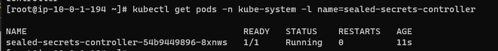
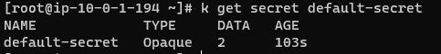
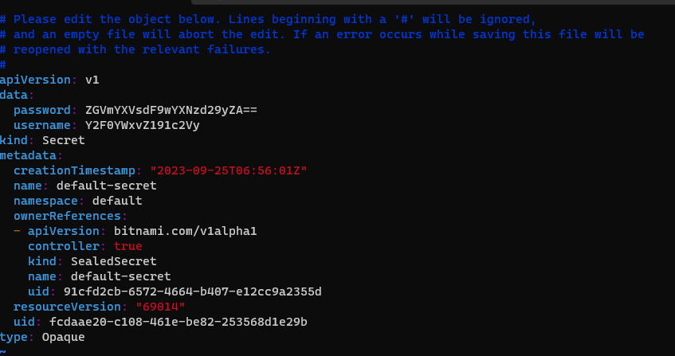

## sealed secret
해당 리포지토리의 최신 릴리스를 다운로드 한다.
- https://github.com/bitnami-labs/sealed-secrets/releases/

```
k apply -f https://github.com/bitnami-labs/sealed-secrets/releases/download/v0.24.0/controller.yaml
wget https://github.com/bitnami-labs/sealed-secrets/releases/download/v0.24.0/kubeseal-0.24.0-linux-amd64.tar.gz
tar zxvf kubeseal-0.24.0-linux-amd64.tar.gz
mv kubeseal /bin/
```

pod의 상태를 확인한다.
```
kubectl get pods -n kube-system -l name=sealed-secrets-controller
```


secret
```
kubeseal --format=yaml < secret.yaml   > /tmp/secret.yaml
kubeseal --fetch-cert > /tmp/public-key-cert.pem
kubeseal --cert=/tmp/public-key-cert.pem --format=yaml < secret.yaml \
  > /tmp/secret.yaml
```

/tmp/secret.yaml
```yaml
apiVersion: bitnami.com/v1alpha1
kind: SealedSecret
metadata:
  creationTimestamp: null
  name: default-secret
  namespace: default
spec:
  encryptedData:
    password: AgBvIitofr/gngwtIwbJz0sa1i/JTwGi9SP25V9uR2pLy+Qm1vtymV5ErjEHTlqTtlGsP8NeppQGXspQFX2iQ6lEd0OBZfQ6m4Rj46rCVIlIyCnRTBKPFLRZExIGS48i2/Is5rwcDYLQb9oqfmVlwUvoUHd6Uo+1V1yrpq6RuZoNAVUTzHRVTGKbStRQVyCGb+7EM+I/ma6FtQlGCod89wyKlMTVqi1bOVB0DOLljRfARZuPTM+VkvIz7q8Zwb0yUAVYYrAapVHulB0kFPKPNNmR1vwu+8cmAaSXiD4DhqymPnZvPBXTlkbscIer7O2UUyuhheMLLrDHEHsUaY7jq5igNLr7Vdd9f7FnVX5W+RCB+WyIHvR6V4yYto3NrHkiHHv9V8YKBgz0/2ZJouV0WpurogO4awcDdzfo0zu3rSAkaRtXuBPMxJGZhOBmTr88Fhih8GNR84L4AJHaiwNn5UcF2q9e7phm/vwCeduO+jE+wlkdN1KOgUPE1XlAbRMROe4Xdfra0eP8czePBx/UwSvv729foA4paSs6/Fc0kQSWrSNHzl8FFB45IJEAFWc9YAwHzCs7YzOIEEDhBhb2oIf31ilmGBeOZhXcKOzsug3VIDeLrO7rKjkKNa4gAyWzBZr3xTbMimdFLKNsQMre8SpT9lxvgCexTXXLxv778jt3w11Y1SOVazR01z0nweWVUBGghxnDkbsBybC4kVJCIRWi
    username: AgB6J9BTIYlLCjoZtOt9Vfnt2bDk7rA2kNAdtND009Rnm4aCkoVhFxo3cH/KRkxrUAoTcmFGa8s9mIj98ynxfiowTOc9TBYyM2rB+cvggb4CWVBKzsDK9R8u+o8TQODnKlKdLkaG5sDrgNGjxOJfFAv7oHIczWY8PjTprzSApt/mQI6qi3F+pPI5tA2bvpU3CmLzhzWEQHwL0xdRFld7fFrnYDTdnN77J3N/6RzT4SLyuH91OP/Jsg76rrU0c+nAJyAH6uhupmboV7c+W3h4gHl1PLhvUvIUCx4Jf4/C9Y/2XkFepGgj/KOnu160KnapV90UyTrKrApfJvh0VQ4TN9hxPT/zgu5etysxO7Gmg0eWD4z8Mv9QxLdKLAFv6luAM9RwXvRYhsxW5zyO2sV7k0Tki9E3YGotLIxJTg1ogUM5c+RjethRnkZi32vhHkVgpszcqjylBtxLSVo40/lzXeX1BJdxN+vz9ABsFS6Ti+li6WZK4iyK+eI5OBA9MWmRGYZJ7RuNkwDRaL7cIPPvjDbc5IUIC0HMZ3vXL38fofXNrgfYO50dS3bhf3lRQDVd7C4alr7HiRBavJ79s426+oPL7WqV5AK8wMOBEmQzTgQ9pgBdO28mfrrBbNb/fLEt2dfcfJM83fWfoSHc+V9NkPoq5YwbQ6nuWhmOcuHUBWeZEPU+zTuSZ1R5q1Uw0gZcF4sAoRy/WQki8d8NEHU=
  template:
    metadata:
      creationTimestamp: null
      name: default-secret
      namespace: default
    type: Opaque
```

deploy secret
```
kubectl apply -f /tmp/secret.yaml
```

get secret
```
k get secret default-secret
```



edit secret
```
k edit secret default-secret
```
