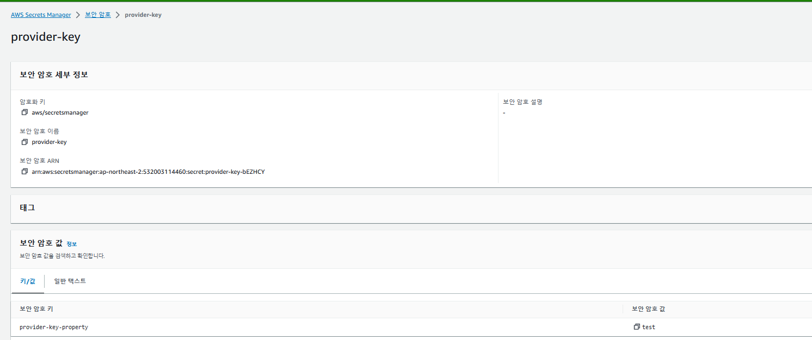
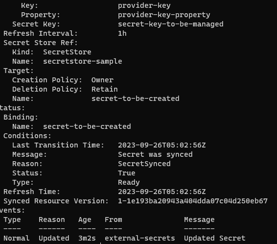

References
- https://external-secrets.io/latest/introduction/getting-started/

## chart
```bash
helm repo add external-secrets https://charts.external-secrets.io

helm install external-secrets \
   external-secrets/external-secrets \
    -n external-secrets \
    --create-namespace \
```

## irsa
```
cat >secret-policy.json <<EOF
{
	"Version": "2012-10-17",
	"Statement": [
		{
			"Sid": "VisualEditor0",
			"Effect": "Allow",
			"Action": [
				"secretsmanager:GetResourcePolicy",
				"secretsmanager:GetSecretValue",
				"secretsmanager:DescribeSecret",
				"secretsmanager:ListSecretVersionIds"
			],
			"Resource": "*"
		}
	]
}
EOF

aws iam create-policy --policy-name secret-policy --policy-document file://secret-policy.json

eksctl create iamserviceaccount --name external-secrets-cert-controller --namespace external-secrets --cluster skills-cluster --attach-policy-arn arn:aws:iam::532003114460:policy/secret-policy --approve --override-existing-serviceaccounts
```


## create secret ( aws certificate )
```
echo -n 'KEYID' > ./access-key
echo -n 'SECRETKEY' > ./secret-access-key
kubectl create secret generic awssm-secret --from-file=./access-key --from-file=./secret-access-key
```

## create secret store
```
k apply -f ./secretstore.yaml
```

## ExternalSecret
externalsecret.yaml에 있는 key부분에는 실제 aws 시크릿매니저에 있는 시크릿 이름을 기제하면 된다.
```
k apply -f ./externalsecret.yaml
```


