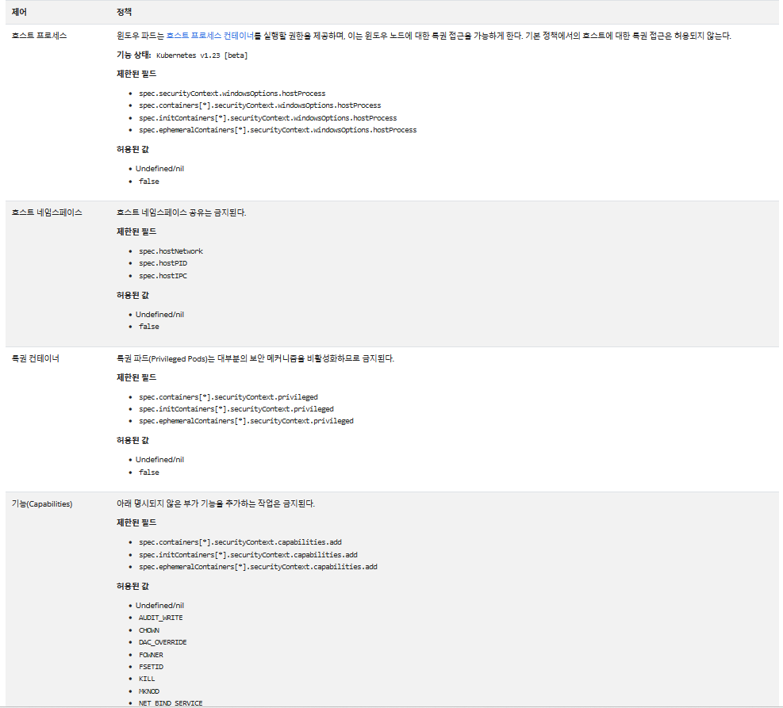

References
- https://kubernetes.io/ko/docs/concepts/security/pod-security-standards/
- https://bcho.tistory.com/1275
- https://freedeveloper.tistory.com/427

## security context
```
컨테이너 내에서 동작하는 프로세스의 사용자 ID (UID)나, 그룹 ID (GID)를 설정하거나, 프로세스에 커널에 대한 접근 권한을 부여하는 것과 같은 기능을 수행할 수 있다.
```

UID와 fs 그룹 아이디를 1000으로 지정
```yaml
spec:
  securityContext:
    runAsUser: 1000
    fsGroup: 1000
```

커널의 모든 권한 사용
```yaml
spec:
  securityContext:
    privileged: true
```

리눅스 커널 권한 부여
- date +%T -s "12:00:00" 명령은 SYS_TIME 커널 권한이 있어야만 가능하다.
```yaml
    securityContext:
      capabilities:
        add: ["NET_ADMIN", "SYS_TIME"]
```

## 자세한 내용
- https://kubernetes.io/ko/docs/concepts/security/pod-security-standards/
