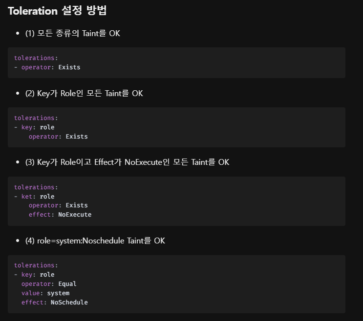

References
- https://velog.io/@junhoskills10/Kubernetes-Taint-Toleration

### node에 taint 추가
```bash
kubectl taint nodes node1 key1=value1:NoSchedule #일치하는 허용범위가 없을 경우 어떤 포드도 예약이 불가능하다. 
```

taint 제거 명령어
```
kubectl taint nodes node1 key1=value1:NoSchedule-
```

taint 종류
```
NoSchedule
Taint Node에 Pod의 스케줄링 금지
기존 실행 중인 Pod는 그대로 두고, 앞으로 실행시킬 Pod에 대해서만 스케줄링을 제한합니다.

NoExecute
Taint Node에 Pod의 실행 금지
앞으로 생성 될 pod에 대한 스케줄링을 제한하고, 기존에 해당 Node에 배치된 Pod를 모두 방출합니다

PreferNoSchedult
Taint Node에 Pod 스케줄링을 선호하지 않습니다. Soft Rule이라 할 수 있습니다.
기존 실행 중인 Pod는 허용하고, 앞으로 생성될 Pod도 스케줄링되는 것을 선호하진 않지만 해당 Node 밖에 스케줄링 될 곳이 없다면 허용해줍니다.
```

둘중 하나를 갖춘 포드는 taint가 걸린 노드를 예약할 수 있다.
```yaml
tolerations:
- key: "key1"
  operator: "Equal"
  value: "value1"
  effect: "NoSchedule"
```
```yaml
tolerations:
- key: "key1"
  operator: "Exists"
  effect: "NoSchedule"
```

톨러레이션을 사용하는 포드의 예
```yaml
apiVersion: v1
kind: Pod
metadata:
  name: nginx
  labels:
    env: test
spec:
  containers:
  - name: nginx
    image: nginx
    imagePullPolicy: IfNotPresent
  tolerations:
  - key: "example-key"
    operator: "Exists"
    effect: "NoSchedule"
```

톨러레이션 설정방법
