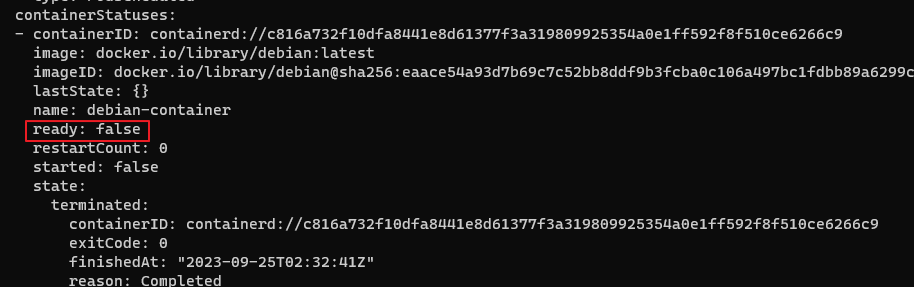

## 공유 볼륨
두 컨테이너를 실행하는 파드 생성
```yaml
apiVersion: v1
kind: Pod
metadata:
  name: two-containers
spec:

  restartPolicy: Never

  volumes:
  - name: shared-data
    emptyDir: {}

  containers:

  - name: nginx-container
    image: nginx
    volumeMounts:
    - name: shared-data
      mountPath: /usr/share/nginx/html

  - name: debian-container
    image: debian
    volumeMounts:
    - name: shared-data
      mountPath: /pod-data
    command: ["/bin/sh"]
    args: ["-c", "echo debian 컨테이너에서 안녕하세요 > /pod-data/index.html"]

```

command
```
k apply -f ./two-container.yaml
```

result
```
[root@ip-10-0-1-194 ]# kubectl exec -it two-containers -c nginx-container -- curl localhost
debian 컨테이너에서 안녕하세요
```

#### Debian container status
```
kubectl get pod two-containers --output=yaml
```

