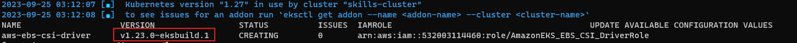

References
- https://docs.aws.amazon.com/ko_kr/eks/latest/userguide/csi-iam-role.html


create sa
```bash
eksctl create iamserviceaccount \
    --name ebs-csi-controller-sa \
    --namespace kube-system \
    --cluster skills-cluster \
    --role-name AmazonEKS_EBS_CSI_DriverRole \
    --role-only \
    --attach-policy-arn arn:aws:iam::aws:policy/service-role/AmazonEBSCSIDriverPolicy \
    --approve
```
#### etc
- https://docs.aws.amazon.com/ko_kr/eks/latest/userguide/csi-iam-role.html

#### EBS CSI Drivers
```bash
eksctl create addon --name aws-ebs-csi-driver --cluster skills-cluster --service-account-role-arn arn:aws:iam::532003114460:role/AmazonEKS_EBS_CSI_DriverRole --force
```

```bash
eksctl get addon --name aws-ebs-csi-driver --cluster skills-cluster
```


addon update
```bash
eksctl update addon --name aws-ebs-csi-driver --version v1.23.0-eksbuild.1 --cluster skills-cluster --force
```
deploy volume
```bash
kubectl apply -f storageclass.yaml && kubectl apply -f PVC.yaml
```

volume mount
```bash
kubectl apply -f ./deployment
```

result
```
k exec -it deploy-7659c9cfb5-hllms -- sh
# cd /usr/share/nginx/html
# echo "helloworld" >> index.html
# exit
[root@ip-10-0-1-194 ]# kubectl exec -it deploy-7659c9cfb5-lpgg7s -- curl localhost
helloworld
[root@ip-10-0-1-194 ]# kubectl exec -it deploy-7659c9cfb5-xdc52 -- curl localhost
helloworld
```