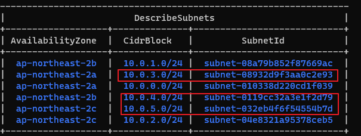
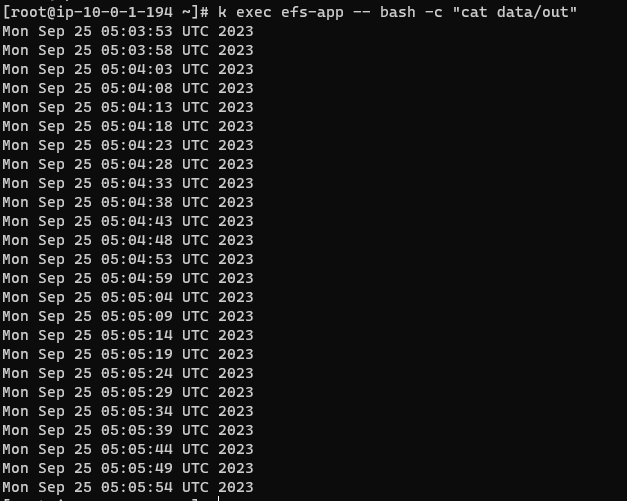
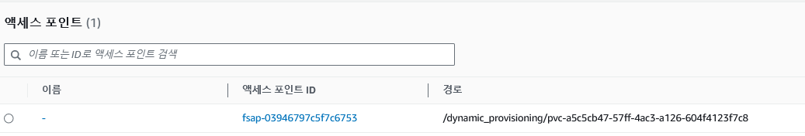

References
- https://kschoi728.tistory.com/94

download iam-policy & create policy
```bash
curl -O https://raw.githubusercontent.com/kubernetes-sigs/aws-efs-csi-driver/master/docs/iam-policy-example.json

aws iam create-policy \
--policy-name AmazonEKS_EFS_CSI_Driver_Policy \
--policy-document file://iam-policy-example.json
```

create sa
```bash
eksctl create iamserviceaccount \
    --cluster skills-cluster \
    --namespace kube-system \
    --name efs-csi-controller-sa \
    --attach-policy-arn arn:aws:iam::532003114460:policy/AmazonEKS_EFS_CSI_Driver_Policy \
    --approve \
    --region ap-northeast-2
```

#### EFS CSI Drivers
```bash
helm repo add aws-efs-csi-driver https://kubernetes-sigs.github.io/aws-efs-csi-driver/
helm upgrade -i aws-efs-csi-driver aws-efs-csi-driver/aws-efs-csi-driver \
    --namespace kube-system \
    --set image.repository=602401143452.dkr.ecr.ap-northeast-2.amazonaws.com/eks/aws-efs-csi-driver \
    --set controller.serviceAccount.create=false \
    --set controller.serviceAccount.name=efs-csi-controller-sa
```

#### Setting variables
```bash
vpc_id=$(aws eks describe-cluster \
    --name skills-cluster \
    --query "cluster.resourcesVpcConfig.vpcId" \
    --output text)

cidr_range=$(aws ec2 describe-vpcs \
    --vpc-ids $vpc_id \
    --query "Vpcs[].CidrBlock" \
    --output text \
    --region ap-northeast-2)
```

#### Setting security group
```bash
security_group_id=$(aws ec2 create-security-group \
    --group-name MyEfsSecurityGroup \
    --description "My EFS security group" \
    --vpc-id $vpc_id \
    --output text)

aws ec2 authorize-security-group-ingress \
    --group-id $security_group_id \
    --protocol tcp \
    --port 2049 \
    --cidr $cidr_range
```

#### create file system
```bash
file_system_id=$(aws efs create-file-system \
    --region ap-northeast-2 \
    --performance-mode generalPurpose \
    --query 'FileSystemId' \
    --output text)

aws ec2 describe-subnets \
    --filters "Name=vpc-id,Values=$vpc_id" \
    --query 'Subnets[*].{SubnetId: SubnetId,AvailabilityZone: AvailabilityZone,CidrBlock: CidrBlock}' \
    --output table
```


```bash
aws efs create-mount-target \
    --file-system-id $file_system_id \
    --subnet-id subnet-08932d9f3aa0c2e93 \
    --security-groups $security_group_id

aws efs create-mount-target \
    --file-system-id $file_system_id \
    --subnet-id subnet-0119cc32a3e1f2d79 \
    --security-groups $security_group_id

aws efs create-mount-target \
    --file-system-id $file_system_id \
    --subnet-id subnet-032eb4f6f54554b7d \
    --security-groups $security_group_id
```

command
```bash
k apply -f storageclass.yaml && k apply -f pvc.yaml && k apply -f pod.yaml
```


