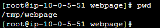

## kubernetes host path

apply pad
```
k apply -f ./pod.yaml
```

#### linux consle




```
[root@ip-10-0-1-194 ~]# k exec hostpath-app -- sh -c "curl localhost"
  % Total    % Received % Xferd  Average Speed   Time    Time     Time  Current
                                 Dload  Upload   Total   Spent    Left  Speed
100   153  100   153    0     0   263k      0 --:--:-- --:--:-- --:--:--  149k
<html>
<head><title>403 Forbidden</title></head>
<body>
<center><h1>403 Forbidden</h1></center>
<hr><center>nginx/1.25.2</center>
</body>
</html>
```

command
```
[root@ip-10-0-5-51 webpage]# echo "hello world" >> ./index.html
[root@ip-10-0-1-194 ~]# k exec hostpath-app -- curl localhost
hello world
  % Total    % Received % Xferd  Average Speed   Time    Time     Time  Current
                                 Dload  Upload   Total   Spent    Left  Speed
100    12  100    12    0     0  25477      0 --:--:-- --:--:-- --:--:-- 12000
```